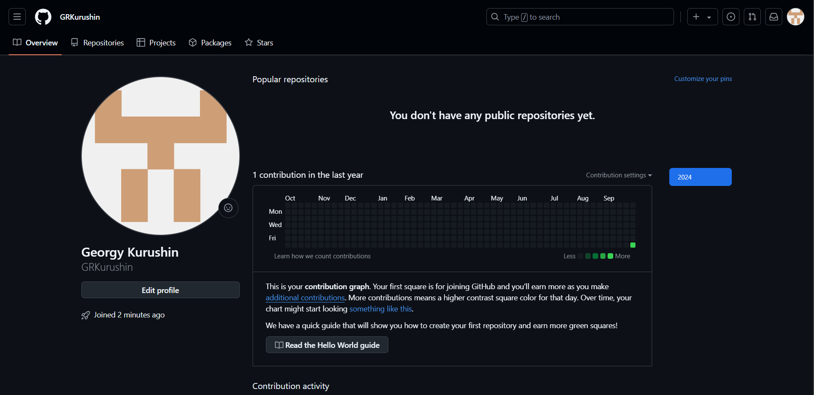
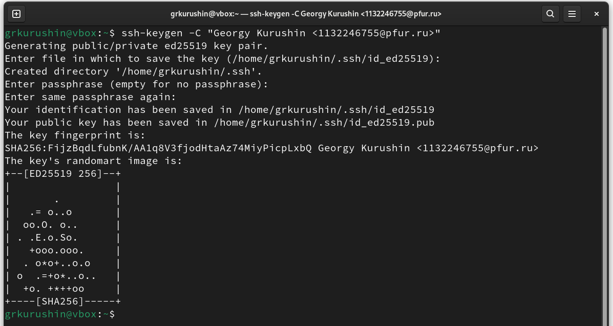
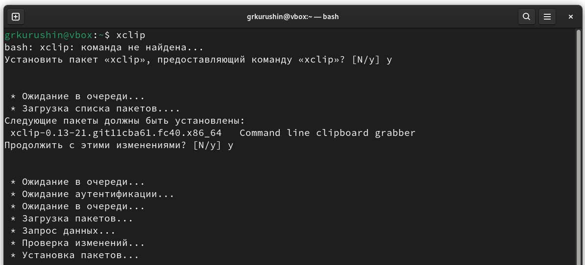
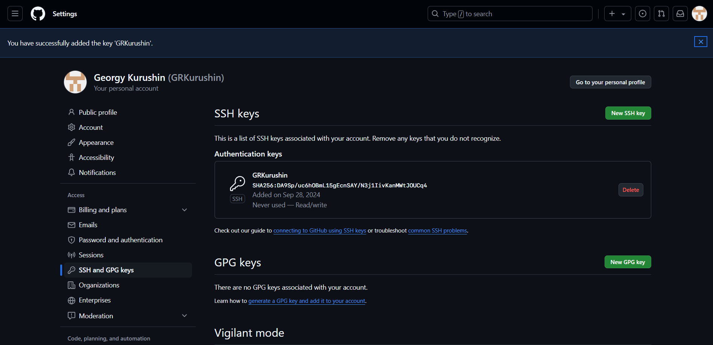
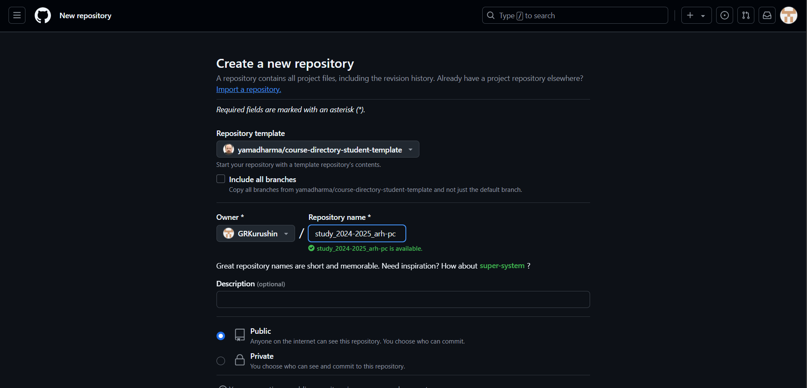
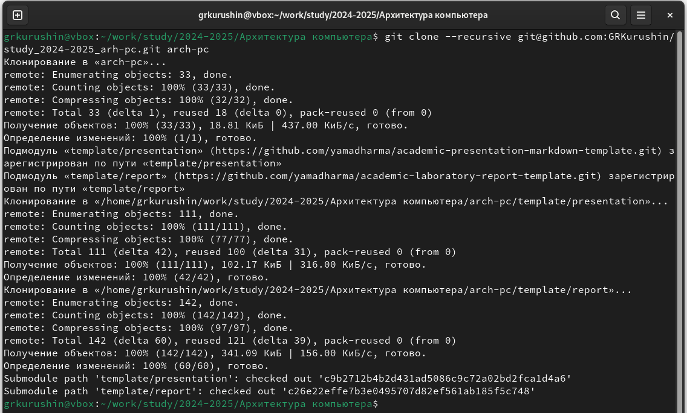
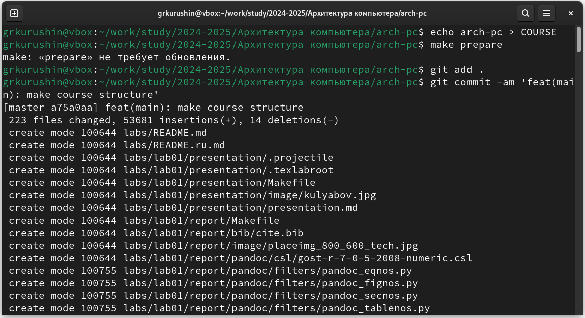
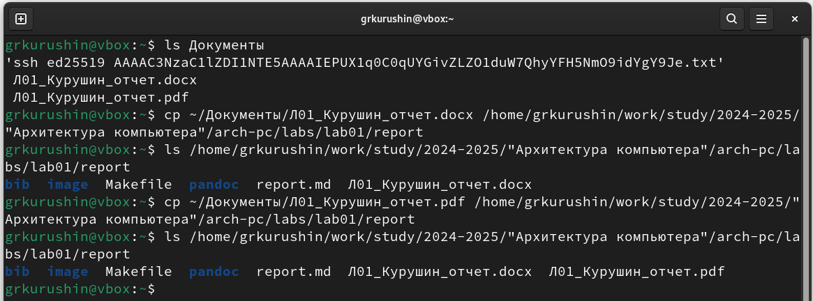
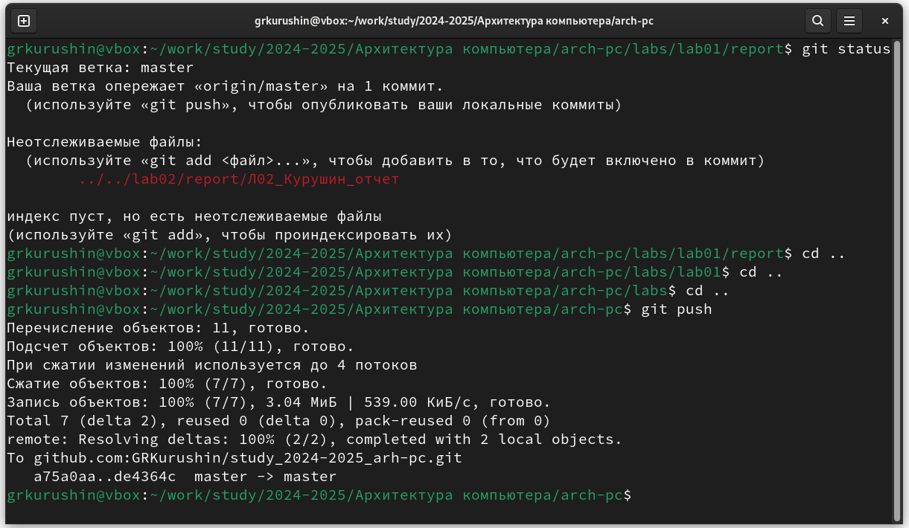
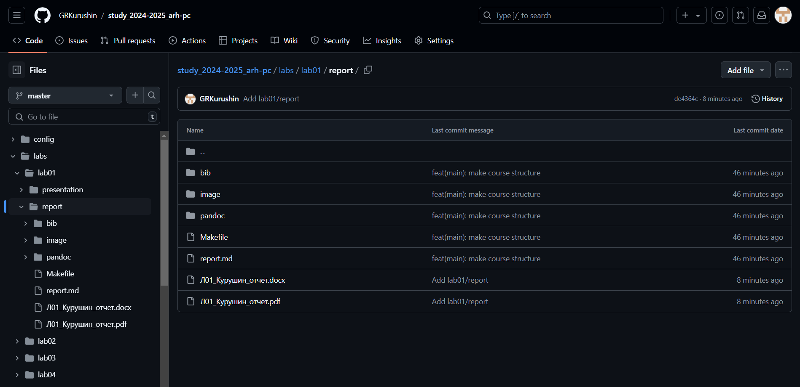

---
## Front matter
title: "Отчёт по лабораторной работе №2"
subtitle: "дисциплина: Архитектура компьютера"
author: "Курушин Георгий Романович"

## Generic otions
lang: ru-RU
toc-title: "Содержание"

## Bibliography
bibliography: bib/cite.bib
csl: pandoc/csl/gost-r-7-0-5-2008-numeric.csl

## Pdf output format
toc: true # Table of contents
toc-depth: 2
lof: true # List of figures
lot: true # List of tables
fontsize: 12pt
linestretch: 1.5
papersize: a4
documentclass: scrreprt
## I18n polyglossia
polyglossia-lang:
  name: russian
  options:
	- spelling=modern
	- babelshorthands=true
polyglossia-otherlangs:
  name: english
## I18n babel
babel-lang: russian
babel-otherlangs: english
## Fonts
mainfont: IBM Plex Serif
romanfont: IBM Plex Serif
sansfont: IBM Plex Sans
monofont: IBM Plex Mono
mathfont: STIX Two Math
mainfontoptions: Ligatures=Common,Ligatures=TeX,Scale=0.94
romanfontoptions: Ligatures=Common,Ligatures=TeX,Scale=0.94
sansfontoptions: Ligatures=Common,Ligatures=TeX,Scale=MatchLowercase,Scale=0.94
monofontoptions: Scale=MatchLowercase,Scale=0.94,FakeStretch=0.9
mathfontoptions:
## Biblatex
biblatex: true
biblio-style: "gost-numeric"
biblatexoptions:
  - parentracker=true
  - backend=biber
  - hyperref=auto
  - language=auto
  - autolang=other*
  - citestyle=gost-numeric
## Pandoc-crossref LaTeX customization
figureTitle: "Рис."
tableTitle: "Таблица"
listingTitle: "Листинг"
lofTitle: "Список иллюстраций"
lotTitle: "Список таблиц"
lolTitle: "Листинги"
## Misc options
indent: true
header-includes:
  - \usepackage{indentfirst}
  - \usepackage{float} # keep figures where there are in the text
  - \floatplacement{figure}{H} # keep figures where there are in the text
---

# Цель работы

Целью работы является применение средств контроля версий. А также очень важно приобрести практические навыки по работе с системой git.

# Задание

1. Настройка GitHub.
2. Базовая настройка Git.
3. Создание SSH-ключа.
4. Создание рабочего пространства и репозитория курса на основе шаблона.
5. Создание репозитория курса на основе шаблона.
6. Настройка каталога курса.
7. Выполнение заданий для самостоятельной работы.

# Теоретическое введение

Система контроля версий ( Version Control System, VCS ) — это инструмент, используемый разработчиками программного обеспечения для управления изменениями в исходном коде и других файловых ресурсах.
Системы контроля версий разработаны специально для того, чтобы максимально упростить и упорядочить работу над проектом (вне зависимости от того, сколько человек в этом участвуют). СКВ дает возможность видеть, кто, когда и какие изменения вносил; позволяет формировать новые ветви проекта, объединять уже имеющиеся; настраивать контроль доступа к проекту ; осуществлять откат до предыдущих версий.
В классических системах контроля версий используется централизованная модель, предполагающая наличие единого репозитория для хранения файлов. Выполнение большинства функций по управлению версиями осуществляется специальным сервером. Участник проекта (пользователь) перед началом работы посредством определённых команд получает нужную ему версию файлов. После внесения изменений, пользователь размещает новую версию в хранилище. При этом предыдущие версии не удаляются из центрального хранилища и к ним можно вернуться в любой момент. Сервер может сохранять не полную версию изменённых файлов, а производить так называемую дельта-компрессию — сохранять только изменения между последовательными версиями, что позволяет уменьшить объём хранимых данных. Системы контроля версий поддерживают возможность отслеживания и разрешения конфликтов, которые могут возникнуть при работе нескольких человек над одним файлом. Можно объединить (слить) изменения, сделанные разными участниками (автоматически или вручную), вручную выбрать нужную версию, отменить изменения вовсе или заблокировать файлы для изменения. В зависимости от настроек блокировка не позволяет другим пользователям получить рабочую копию или препятствует изменению рабочей копии файла средствами файловой системы ОС, обеспечивая таким образом, привилегированный доступ только одному пользователю, работающему с файлом. Демидова А. В. 14 Архитектура ЭВМ Системы контроля версий также могут обеспечивать  дополнительные,  более  гибкие  функциональные  возможности.
Например, они могут поддерживать работу с несколькими версиями одного файла, сохраняя общую историю изменений до точки ветвления версий и собственные истории изменений каждой ветви. Кроме того, обычно доступна информация о том, кто из участников, когда и какие изменения вносил. Обычно такого рода информация хранится в журнале изменений, доступ к которому можно ограничить. В отличие от классических, в распределённых системах контроля версий центральный репозиторий не является обязательным. Среди классических VCS наиболее известны CVS, Subversion, а среди распределённых — Git, Bazaar, Mercurial. Принципы их работы схожи, отличаются они в основном синтаксисом используемых в работе команд.
Система контроля версий Git представляет собой набор программ командной строки. Доступ к ним можно получить из терминала посредством ввода команды git с различными опциями. Благодаря тому, что Git является распределённой системой контроля версий, резервную копию локального хранилища можно сделать простым копированием или архивацией.

# Выполнение лабораторной работы

## Настройка GitHub

Для	выполнения	лабораторной	работы	создаю	учетную	запись	на https://github.com/

{#fig:001 width=70%}

## Базовая настройка git

Делаю предварительную конфигурацию git. Захожу в терминал и ввожу команды, указывая свое имя и email

{#fig:002 width=70%}

Настраиваю utf-8 в выходе сообщений git

{#fig:003 width=70%}

Задаю имя начальной ветки, которую буду называть master

{#fig:004 width=70%}

А также ввожу autocrlf и safecrlf

{#fig:005 width=70%}

## Создание SSH ключа

Для последующей идентификации пользователя на сервере репозиториев генерирую пару ключей (приватный и открытый).

{#fig:006 width=70%}

Чтобы скопировать из локальной консоли ключ в буфер обмена, устанавливаю команду xclip

{#fig:007 width=70%}

Теперь воспользуюсь командой xclip

{#fig:008 width=70%}

Вставляю ключ в появившееся на сайте поле, указываю его имя.

{#fig:009 width=70%}

## Создание рабочего пространства, репозитория курса на основе шаблона

Открываю терминал и создаю репозиторий для предмета «Архитектура компьютера»

{#fig:010 width=70%}

## Создание репозитория курса на основе шаблона

Захожу на страницу репозитория с шаблоном курса, выбираю его в качестве своего нового

{#fig:011 width=70%}

Далее создаю его, задав ему имя

{#fig:012 width=70%}

Открываю терминал и перехожу в каталог курса

{#fig:013 width=70%}

Клонирую созданный репозиторий

{#fig:014 width=70%}

## Настройка каталога курса

Перехожу в каталог курса и удаляю лишние файлы

{#fig:015 width=70%}

Создаю необходимые каталоги, отправляю файлы на сервер

{#fig:016 width=70%}

В локальном репозитории проверяю результат выполненной работы

{#fig:017 width=70%}

## Выполнение заданий для самостоятельной работы

Создаю отчет по выполнению второй лабораторной работы в соответствующем каталоге. С помощью команды ls проверяю, создан ли файл

{#fig:018 width=70%}

Для выполнения второго задания проверяю местонахождение своих лабораторных работ

{#fig:019 width=70%}

Копирую	лабораторную	работу	с	помощью	утилиты	cp, проверяю местонахождение файлов с помощью команды ls

{#fig:020 width=70%}

Для того чтобы загрузить эти файлы на GitHub, в первую очередь я использую команду git add. Так добавленные мной файлы станут отслеживаемыми

{#fig:021 width=70%}

Теперь осуществляю полноценный перенос файлов с помощью команды git commit -m “…”

{#fig:022 width=70%}

Использую команды: git status и git push, чтобы опубликовать свои локальные коммиты

{#fig:023 width=70%}

Перехожу в каталоги на GitHub, чтобы убедиться в том, что файлы находятся в нужных репозиториях

{#fig:024 width=70%}

# Выводы

В заключение хочется отметить, что данная лабораторная работа позволила мне научиться работать с системой Git. Я практиковал свои навыки в работе с командной строкой, теперь уже связывая выполнимое с директориями GitHub.

# Список литературы{.unnumbered}

[Архитектура ЭВМ](https://esystem.rudn.ru/pluginfile.php/2089082/mod_resource/content/0/Лаборато рная%20работа%20№2.%20Система%20контроля%20версий%20Git.pdf)

[30 команд Git, необходимых для освоения интерфейса командной строки Git](https://habr.com/ru/companies/ruvds/articles/599929/)

[Система контроля версий: определение, функции, популярные решения](https://gb.ru/blog/sistema-kontrolya-versij/)
